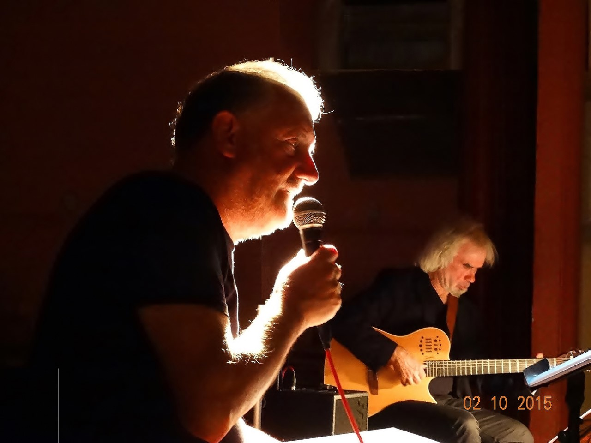

```json
{ "id": "2022-39", "bdate": "2022-09-28",
"edate": "2022-10-09", "mailed": "" }
```


# LITURGISCHE VIERINGEN


## LITURGISCHE VIERINGEN2

```json
{ "type": "mass", "lastpb": "2022-39", "count": "1" }
```

Woensdag 28/09
08.30 u. nazareth: EUCHARISTIE

Donderdag 29/09
HEMELVAART
**Pater Pio**
08.00 eke: EUCHARISTIE
Er zijn ook *andere* jaargetijden


# LITURGISCHE TEKSTen


## BEZINNING BIJ DE ZONDAGSVIERINGEN

```json
{ "lastpb": "2022-39", "count": "1" }
```

=


# PAROCHIAAL NIEUWS - ONZE-LIEVE-VROUW GEBOORTE NAZARETH & SINT-AMANDUS EKE
## VORMSELCATECHESE SINT AMANDUS EKE

```json
{ "lastpb": "2022-39", "count": "2" }
```


**"Geloven, niet alleen, maar samen"**

Toon `aaa` en `bbb`
`ccc`

`ddd`

 Dag mensen allemaal,
Samen met onze catechisten zijn we nu
onderweg naar ons Vormsel en tijdens onze `bijeenkomsten` en *vergaderingen* en **ontmoetingen**
willen we telkens weer een stukje Jezus ontdekken.
We willen dan ook graag bij de groep van mensen horen


## PAROCHIEBLAD - HERABONNERING 2023

{ "lastpb": "2022-39", "count": "2" }

Hopelijk genoot u van een deugddoende vakantie. Bij Halewijn bereiden ze ondertussen volop de (her)abonneringscampagne voor.

Ongetwijfeld ondervindt u het ook zelf: we beleven tijden van torenhoge inflatie. Ook de uitgeverswereld ontsnapt hier niet aan. De grondstofprijzen voor onder meer papier en inkt, alsook de energie- en distributieprijzen zijn extreem gestegen in de voorbije maanden. En de lonen volgen dezelfde trend door de indexaanpassing. De komende maanden beloven financieel weinig beterschap, integendeel allicht. Uitgeverij Halewijn moet dit helaas onvermijdelijk doorrekenen in de abonnementsprijs van het parochieblad. Op basis van alle recente en nog te verwachten prijsstijgingen - in combinatie met de jaarlijkse procentuele daling van de oplage - ziet Halewijn zich genoodzaakt de tarieven ook dit jaar te verhogen.

Dit geeft dan volgende tarieven (verzending als postabonnement in België inbegrepen):
Gewoon abonnement: **52 EUR**
Steunabonnement: **54 EUR**

We beseffen dat dit hoe dan ook een meer dan gemiddelde prijsstijging is ten opzichte van de voorgaande jaren. In de huidige omstandigheden blijven we echter met de nieuwe tarieven nog fiks ónder de reële kostprijs van een jaarabonnement. Een bewuste keuze omdat we onze trouwe lezers niet willen bruuskeren en omdat we elke week voor ongeveer 1 EUR een kwaliteitsvol blad in de brievenbus willen laten vallen.

Voor Nazareth en Eke wijzigt er niets aan de manier van herabonneren. Voor alle straten waar we nog een vrijwilliger hebben, mag u een vrijwilliger aan uw deur verwachten. Indien u niet thuis bent, zal de vrijwilliger een overschrijvingsformulier in de bus steken.
Voor de straten waar we geen vrijwilliger meer hebben, zal u gewoon een overschrijvingsformulier in de bus vinden.

Mogen we vragen om bij overschrijving steeds de gestructureerde mededeling te gebruiken. Dit vergemakkelijkt het boeken van de betalingen en vermijdt fouten indien u voor iemand anders zou betalen.

*Graag ook uw aandacht voor het volgende: vanaf **01 januari 2023** komt er 1 parochieblad voor de parochies Asper, Eke, Gavere en Nazareth.*
*Meer parochies betekent ook meer parochiaal nieuws uit andere parochies.*
*Hierdoor zullen de mededelingen van de verenigingen niet altijd kunnen opgenomen worden.*
*Ook het mailadres voor het inzenden van teksten door de `verenigingen` zal wijzigen, maar hierover hoort u binnenkort meer.*


# VERENIGINGEN EN SCHOLEN


## LANDELIJKE GILDE EN FERM (EKE EN NAZARETH)

{ "lastpb": "2022-39", "count": "2" }

wandel.jpg Ontbijt bij de boer (copyright Landelijke Gilde) © lg


## LANDELIJKE GILDE, FERM EN KLJ NAZARETH

```json
{"lastpb": "2022-39", "count": "2" }
```




Landelijke Gilde, Ferm en KLJ Nazareth organiseren naar jaarlijkse gewoonte hun Barbecue.

Deze barbecue gaat door op zondag **02 oktober 2022** in CC Het Centrum.

Aanschuiven kan vanaf 11.30 u. tot en met 13.30 u.

Volwassenen: 18 EUR
Kinderen (6 jaar tem 12 jaar): 10 EUR
Kinderen onder 6 jaar: gratis
Inclusief dessert

Kaarten reserveren kan bij onderstaande bestuursleden tot en met woensdag **28 september 2022**:
Peter - LG: 0484 96 90 07, Sabine - Ferm: 0498 93 10 95, Mathijs - KLJ: 0498 57 17 72


## SAMANA NAZARETH

{ "lastpb": "2022-39", "count": "2" }

De activiteiten van Samana tem december 2022

Crea: **11 oktober 2022**, **08 november 2022** en **13 december 2022**. Zoals gewoonlijk in CC Het Centrum om 14.00 u. Gratis inkom en iedereen is welkom.

De uitstap met de leden van Samana gaat door op zaterdag **24 september 2022**. Dit jaar gaan we naar Eurotuin in Merelbeke. Meer info volgt.

Ook reeds te noteren: op zaterdag **17 december 2022** is er ons Kerstfeestje met koffietafel in CC Het centrum om 14.00 u.


## OKRA TREFPUNT NAZARETH

{ "lastpb": "2022-39", "count": "2" }

Activiteitenkalender voor september 2022
woensdag **21 september 2022**: Kermis koffietafel om 14.00 u in CC Het Centrum
donderdag **22 september 2022**: Fietsen om 14.00 u aan CC Het Centrum
maandag **26 september 2022**: Bestuursvergadering om 09.30 u. CC Het Centrum
dinsdag **27 september 2022**: Petanque om 14.00 u aan de Sporthal
donderdag **29 september 2022**: Lijndansen om 14.00 u in CC Het Centrum

!!! Voor meer info: tel. 09 395 53 71


# NIEUWS VAN BUITEN ONZE PAROCHIEGRENZEN


# WACHTDIENSTEN


## WACHTDIENSTEN

**Dokter**

Via het wachtnummer **1733**, ieder weekend van vrijdag 19.00 u. tot maandag 08.00 u. (Huisartsenwachtpost in AZ Sint-Vincentius Deinze)

**Tandarts:**

**0903 39 969** (algemeen betalend wachtdienstnummer)

**Wit-Gele Kruis team Nazareth-Eke:**

Steenweg 167A
9810 Nazareth
09 371 43 35

a

**Apotheker**

GEOWACHT

Over dag (tot 22.00 u.) kan je de apotheek van wacht terugvinden via de website *www.geowacht.be* of tel. **0903 99 000**.

Uit veiligheidsredenen worden de apotheken met nachtwacht niet geafficheerd of publiek bekend gemaakt.

TEST

ok quote `hier` en nog


En deze hier ` space `


En deze empty `a`
is dit quoted \\`quoted?\\`

Unescaped quote `en` nog

Escaped quote \` en nog

Met eol `hier
tot hier met eol`

tekstje
Met eol2 `hier
tot hier\`

en met bold `met *bold*`

en dit dan `met *bold`
EINDE

## xyz
start hier een paragraaf


## valid


